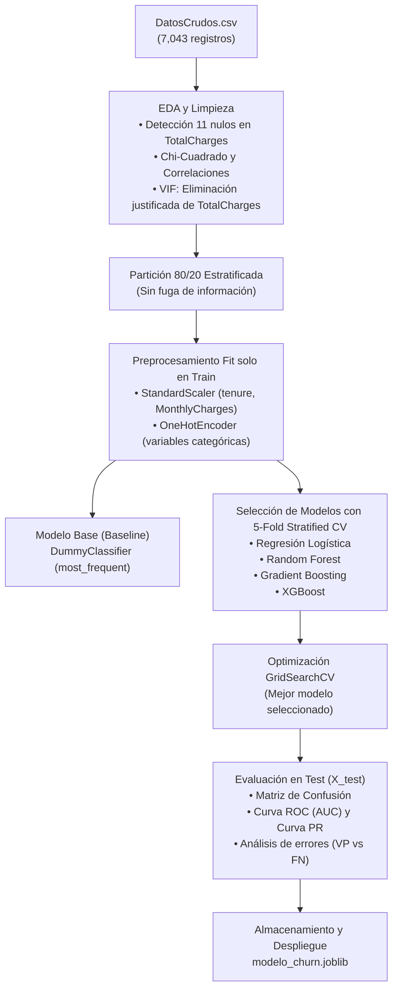

# 📡 Telco Customer Churn Prediction

> Proyecto desarrollado para el curso **Inteligencia Artificial para las Ciencias e Ingenierías** — Universidad de Antioquia (UdeA).

<div align="center">

### Modelo de Machine Learning Supervisado para la Detección Temprana de Fuga de Clientes

<p>
  Identificación proactiva de clientes en riesgo de deserción en servicios de telecomunicaciones mediante modelos de ensamble y optimización de hiperparámetros.
</p>


[](https://colab.research.google.com/github/CaroGomezO/telco-customer-churn-prediction/blob/feature/persitencia-modelo/Telco_Customer_Churn_Pipeline_Completo.ipynb)

</div>


## Integrantes del Equipo
* **Carolina Gómez Osorno** — [@CaroGomezO](https://github.com/CaroGomezO)
* **Julián Esteban Hurtado Serna** — [@Julian-debug-s](https://github.com/Julian-debug-s)
* **Emanuel López Franco** — [@ema28pro](https://github.com/ema28pro)

## Descripción del Problema

En la industria de telecomunicaciones, la deserción de clientes (*Customer Churn*) representa uno de los mayores impactos sobre los ingresos y la cuota de mercado. Atraer a un nuevo cliente cuesta entre 5 y 25 veces más que retener a uno existente. 

Este proyecto aborda la necesidad de la compañía de identificar de forma automatizada y temprana qué usuarios presentan una alta probabilidad de cancelar su suscripción en el próximo ciclo, permitiendo al área de fidelización diseñar ofertas y retenciones preventivas antes de que el cliente abandone el servicio.

## Objetivo del Modelo

Diseñar, entrenar, optimizar y almacenar un modelo de aprendizaje automático supervisado capaz de:
1. Clasificar binariamente si un cliente cancelará o no su servicio (`Churn = Yes` / `Churn = No`).
2. Priorizar el **Recall** (capturar a la mayor cantidad posible de clientes en fuga) sin degradar excesivamente la **Precisión** (evitar costos de retención innecesarios en falsas alarmas), evaluado formalmente a través del **F1-score** y el **ROC-AUC**.


##  Fuente del Conjunto de Datos

* **Origen:** Dataset público *Telco Customer Churn* de IBM Cognos Analytics / [Kaggle](https://www.kaggle.com/datasets/blastchar/telco-customer-churn).
* **Observaciones:** 7,043 clientes.
* **Variables:** 21 características iniciales (información demográfica, servicios contratados de telefonía/internet, tipo de contrato, facturación y la variable objetivo `Churn`).
* **Tratamiento de nulos:** Se detectaron 11 registros no numéricos en `TotalCharges` correspondientes a usuarios nuevos con antigüedad de 0 meses (`tenure == 0`).
* **Tratamiento de multicolinealidad:** Mediante el Factor de Inflación de la Varianza (VIF), se evidenció una colinealidad crítica en `TotalCharges` (VIF > 9.5), procediendo a su eliminación técnica justificada para preservar únicamente `tenure` y `MonthlyCharges` (VIF resultante = 1.07).


## Algoritmos Evaluados y Modelo Seleccionado

Se compararon cuatro familias de algoritmos supervisados utilizando **validación cruzada estratificada de 5 divisiones (`StratifiedKFold`)** para garantizar solidez estadística:

| Algoritmo | Accuracy (CV) | Precision (CV) | Recall (CV) | F1-Score (CV) | ROC-AUC (CV) | Consistencia (Std F1) |
| :--- | :---: | :---: | :---: | :---: | :---: | :---: |
| **Gradient Boosting** | **80.4%** | **66.8%** | **53.6%** | **0.595** | **0.846** | **± 0.018** |
| **Regresión Logística** | 80.1% | 65.2% | 54.4% | 0.593 | 0.846 | ± 0.028 |
| **Random Forest** | 78.7% | 63.3% | 47.9% | 0.545 | 0.824 | ± 0.023 |
| **XGBoost** | 78.5% | 61.2% | 51.5% | 0.558 | 0.827 | ± 0.026 |

* **Modelo Final Seleccionado:** **`GradientBoostingClassifier`**, optimizado vía `GridSearchCV` (`learning_rate=0.05`, `max_depth=3`, `n_estimators=150`, `subsample=0.8`), debido a su balance superior de F1 y su mínima varianza entre pliegues.


## Métricas Empleadas y Justificación

Dado que la variable objetivo `Churn` presenta un **desbalance natural de clases** (~73.5% No Churn vs. ~26.5% Churn), la métrica tradicional de *Accuracy* resulta engañosa: un modelo trivial que predijera que ningún cliente se va obtendría 73.5% de acierto pero sería 100% inútil para el negocio.

Por ello, se seleccionaron:
* **F1-Score (Métrica rectora de optimización):** Media armónica entre Precisión y Recall sobre la clase positiva (`Churn = 1`).
* **ROC-AUC:** Capacidad de discriminación probabilística del modelo en todos los umbrales de corte posibles.
* **Recall / Sensibilidad:** Porcentaje de desertores reales que son detectados a tiempo.


## Principales Resultados Obtenidos

Sobre el conjunto de prueba independiente (`X_test`, 1,409 clientes no vistos):

* **Superación del Modelo Base:** El clasificador base (`DummyClassifier`) obtuvo un F1 y Recall de **0.00**. El modelo predictivo final alcanzó un **F1 de 0.58** y un **ROC-AUC de 0.845**.
* **Detección Efectiva:** Identifica con éxito a más del **52% de los clientes en riesgo** con una precisión del **65%**, reduciendo sustancialmente la fuga involuntaria.
* **Variables Más Determinantes:** El análisis de importancia de variables reveló que los factores que más impulsan el abandono son:
  1. Contrato mes a mes (`Contract_Month-to-month`).
  2. Baja antigüedad (`tenure`).
  3. Cargos mensuales elevados (`MonthlyCharges`).
  4. Tipo de servicio de internet de fibra óptica sin servicios de seguridad/soporte añadidos.


## Almacenamiento del Modelo

**Archivo:** [`modelo_churn.joblib`](./modelo_churn.joblib)  
Permite su carga inmediata mediante `joblib.load()` y validación de consistencia predictiva sin necesidad de reentrenar.


## Instrucciones para Ejecutar el Proyecto

### 1. Clonar el repositorio
```bash
git clone https://github.com/CaroGomezO/telco-customer-churn-prediction.git
cd telco-customer-churn-prediction
```

### 2. Crear y activar un entorno virtual (Recomendado)
```bash
# En Windows (PowerShell)
python -m venv .venv
.venv\Scripts\Activate.ps1

# En Linux / macOS
python3 -m venv .venv
source .venv/bin/activate
```

### 3. Instalar las dependencias
```bash
pip install -r requirements.txt
```

### 4. Ejecutar el Notebook
Puedes abrir y ejecutar el notebook completo en **VS Code**, **Jupyter Notebook** o **JupyterLab**:

```bash
jupyter lab
```

Abre y ejecuta las celdas secuencialmente en:
* **`Telco_Customer_Churn_Pipeline_Completo.ipynb`** *(Notebook integral de principio a fin: desde DatosCrudos.csv hasta el modelo serializado)*.


## Flujo del Pipeline (Arquitectura)

